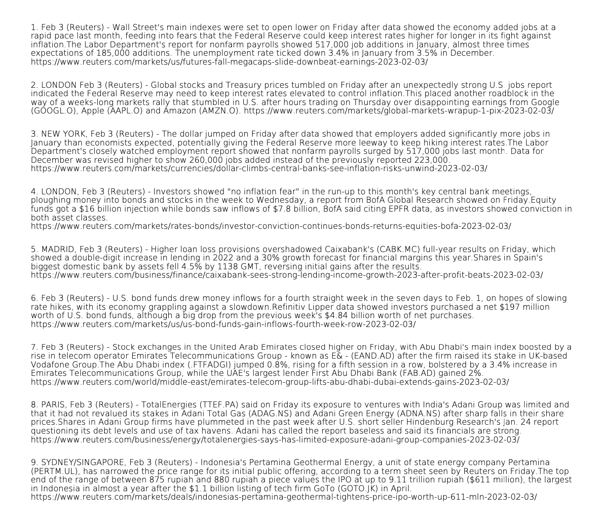

# Automated Newsletter #

A script that uses Slenium and PyFPDF to scrape Reuters.com for finacial stories in certain categories: [ US Markets, EU Markets, Macro Matters, Stocks, Deals, Commodities ]
and outputs a small summary of the article along with the link to the article as a PDF to a specified directory.

# Setup 

Requires 3 environment variables to function, stored in .bash_profile / .zshrc / or other realevant shell profile. 

- Login:
  - In order to view multiple stories Reuters requires you to register an account. For the script to login, email and password for Reuters.com are are required.
    1. Password: 
    `export RU_PASS="password"`
    2. Email:
    `export RU_MAIL="email"`
- PDF generation:
  - The PyFPDF Library is configured to use the 'latin-1' codec by default and some articles contain non supported characters. To bypass this, a UTF-8 font is required which can be accesed by the script via an environemnt variable that points to the path of a utf font.
    1. Font:
    `export NEWSLETTER_FONT='/Path/to/UTF-8font/`. 
    
 environments variables are required to be named exactly as show and are case sensitive   
# Functionality

2 prompts when script is run:
1. "Select a category: [ US_MARKETS, EU_MARKETS, MACRO_MATTERS, STOCKS, DEALS, COMMODITIES ]"   
 input is not case sentivie but requires underscores where applicable, will continue to loop until valid category is given.   
2. "Specify a Directory: "  
 uses os to validate directory, will continue to loop until valid directory is given.  

# Example Output

After completion a PDF labelled "newsletter {mm-dd-YYYY}" will be generated in the specified directory.  

Example:

# Disclaimer

**Scraping content from the Reuters.com is against their TOS, this repo is soley for educational/demonstrative purposes.  I have no affiliation with Reuters.com and neither I nor the this script are held liable for any consequences resulting from this scripts use in a practical setting.**
---------------------------------
 ### Reuters TOS
 *8. Restrictions on Use*

  - **a. _THE SERVICE AND THE CONTENT IS PROVIDED BY REUTERS AND ITS LICENSORS TO YOU FOR YOUR PERSONAL USE AND INFORMATION ONLY. YOU MAY NOT USE THE SERVICE OR THE CONTENT FOR ANY COMMERCIAL PURPOSE._**

  - *b. You promise that you are accessing, using, and/or registering to the Service in your personal, individual capacity (except, if applicable, where your access falls under a group subscription agreement in accordance with Section 1(f)). You agree not to use, transfer, distribute, and/or dispose of the Service or Content in any manner that could compete with the business of Reuters or any of its partners. You may not use the Content or Service, including without limitation, any Content made available through an RSS feed, in any commercial product or service, without our prior written consent.*

  - *c. Without our prior written consent:*

    - *You may not remove, alter, forward, scrape, frame, in-line link, copy, sell, distribute, retransmit, create derivative works or otherwise make available (to third parties and/or on another website, app, blog, product, or service) the Content, except as occasionally permitted by certain sharing features in the Service that explicitly allow you to share Content or links to Content with a few other individuals.*
    - *You may not use any robots, spiders, scripts, service, software or manual or automatic device, tool, or process designed to data mine or scrape the Content, data or information from the Service, or otherwise access or collect the Content, data or information from the Service using automated means.*
